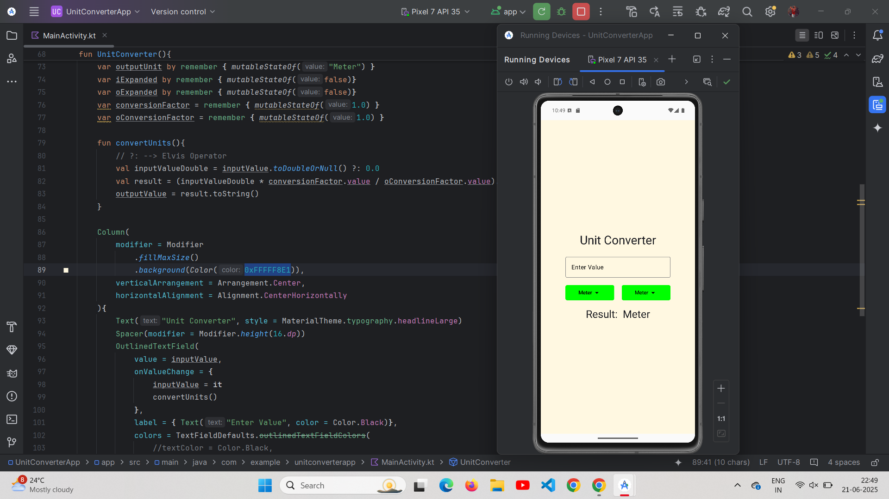
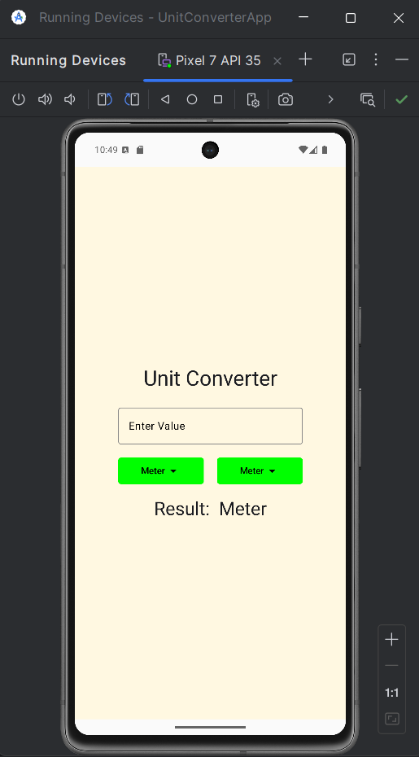
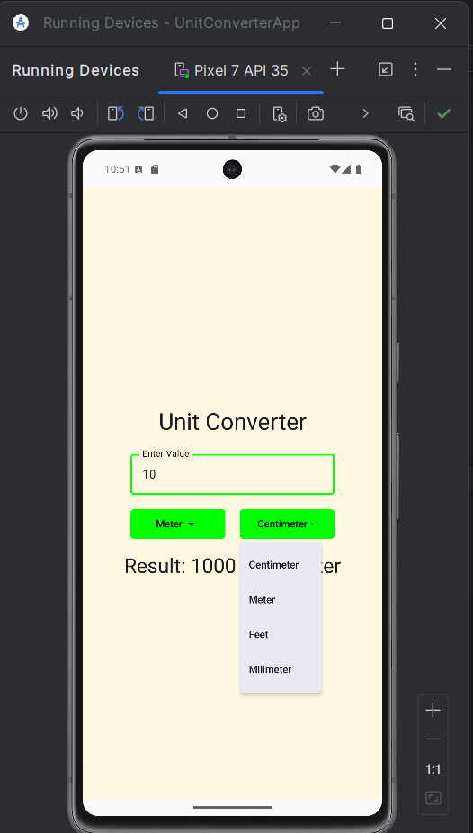
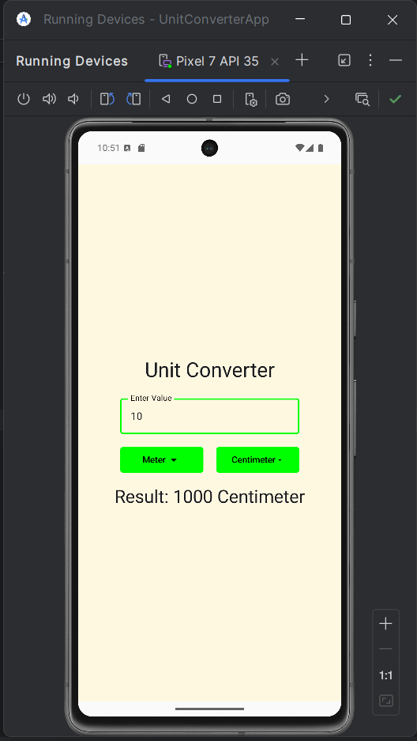
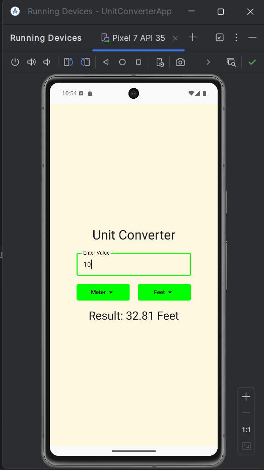

<h1 align="center">📱 Unit Converter App</h1>

  A simple and interactive Unit Converter Android app built using Kotlin and Jetpack Compose.

<h2>✨ Features</h2>

<ul>
  <li>Real-time unit conversion as user types</li>
  <li>Supports Meter, Centimeter, Millimeter, and Feet</li>
  <li>Interactive dropdowns for selecting units</li>
  <li>Clean, Compose-based UI with custom styling</li>
</ul>

<h2>📸 Code and Output</h2>

<h3>🏠 Home Screen (Landscape)</h3>

  

<h3>📱 First Screen and Unit Selection (Side by Side)</h3>

  
  &nbsp;&nbsp;
  

<h3>📏 Meter to Centimeter and Meter to Feet Conversion</h3>

  
  &nbsp;&nbsp;
  

<h2>📚 Tech Stack</h2>

<ul>
  <li>Kotlin</li>
  <li>Jetpack Compose</li>
  <li>Android Studio</li>
</ul>

<h2>🎯 Learning Goals</h2>

<ul>
  <li>Learn Jetpack Compose basics</li>
  <li>Practice state management using <code>remember</code> and <code>mutableStateOf</code></li>
  <li>Explore custom Compose UI styling</li>
</ul>

<h2>🤝 Contributions</h2>

  Contributions, issues, and feature requests are welcome! 
  Feel free to fork this repo and submit a pull request.

